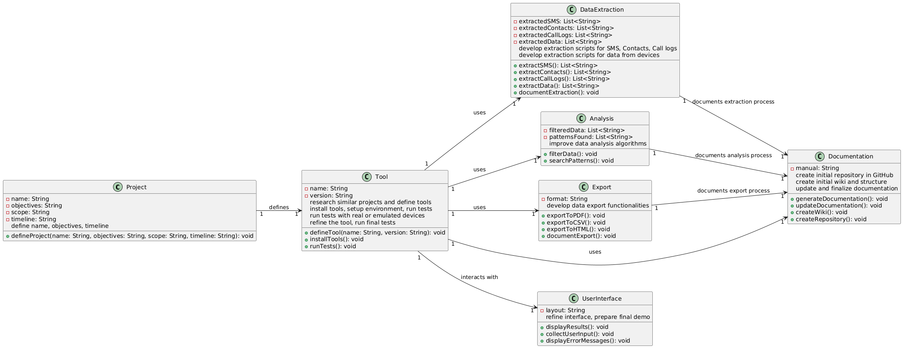
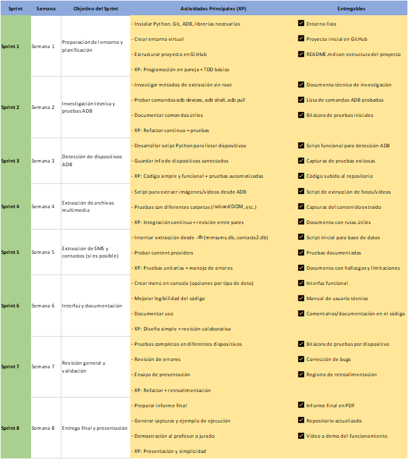

<<<<<<< HEAD
# 🔍 Proyecto de Investigación Forense Móvil

Este proyecto tiene como objetivo desarrollar una herramienta forense en Python orientada al análisis y recuperación de datos desde dispositivos móviles (principalmente Android), utilizando imágenes digitales simuladas. Su finalidad es apoyar procesos de investigación digital mediante la extracción, análisis y visualización de evidencias, contribuyendo al fortalecimiento de prácticas forenses en el ámbito académico y profesional.

---

## 📌 Enlaces de Apoyo

- **Trello:** [Tablero del proyecto en Trello](https://trello.com/invite/b/6802bb04599629f0857ec560/ATTI5ef1a771555e1333de87531461616076D3649F0E/proyecto-de-ing-de-software)  
- **Lucidchart:** [Diagramas del sistema en Lucidchart](https://lucid.app/lucidchart/103312e1-8ae2-4878-a567-67887c13c2e9/edit?viewport_loc=-580%2C-337%2C1738%2C792%2C0_0&invitationId=inv_c61a65f1-2868-4fbc-83a7-18b76a318f30)

---

## 🎯 Objetivos del Proyecto

- Diseñar una herramienta forense para análisis digital en móviles.
- Simular escenarios de recuperación de datos relevantes para una investigación.
- Aplicar técnicas de ingeniería inversa y parsing de datos en Android.
- Presentar resultados claros y legibles para su uso como evidencia.
- Implementar una arquitectura basada en el **patrón MVC** para facilitar el mantenimiento y la escalabilidad.

---

## 📱 Funcionalidades del Sistema

- Interfaz gráfica tipo smartphone desarrollada con **PyQt6**.
- **Conexión a red Wi-Fi desde PC** (vía ADB).
  - Paso 1: Selección de red
  - Paso 2: Ingreso de contraseña
  - Paso 3: Confirmación de conexión
- Visualización de **mensajes (SMS)**.
- Acceso al **registro de llamadas**.
- Lectura de **chats de WhatsApp** (sin root).
- Acceso a **ajustes del sistema**: brillo, volumen, Wi-Fi, Bluetooth, modo avión.
- Control remoto para **bloquear/desbloquear el dispositivo**.
- Visualización y análisis de **aplicaciones instaladas**.

---

## 🧠 Importancia del Análisis Forense Móvil

Dado el papel central de los teléfonos móviles en la vida cotidiana (y también en delitos), el análisis forense permite recuperar y preservar evidencias digitales que pueden usarse en procesos judiciales, auditorías e investigaciones internas. Contar con herramientas que simulen este proceso de forma académica fortalece las competencias técnicas de estudiantes de ingeniería de software, seguridad informática y criminalística digital.

---

## 🗂 Estructura del Proyecto

```plaintext
mi-app-celular/
│
├── main.py
├── README.md
├── requirements.txt
│
├── assets/
│   └── (todos los PNG mencionados)
│
├── src/
│   ├── __init__.py
│   ├── app.py
│   ├── components/
│   │   ├── __init__.py
│   │   ├── fondo.py
│   │   ├── icono.py
│   │   └── screen.py
│   │
│   └── screens/
│       ├── __init__.py
│       ├── menu.py
│       ├── ajustes.py
│       ├── llamadas.py
│       └── apps.py
│
└── tests/
    ├── __init__.py
    ├── conftest.py
    ├── test_components/
    │   ├── __init__.py
    │   ├── test_fondo.py
    │   ├── test_icono.py
    │   └── test_screen.py
    │
    └── test_screens/
        ├── __init__.py
        ├── test_menu.py
        ├── test_ajustes.py
        ├── test_llamadas.py
        └── test_apps.py
```

---

## 📦 Entregables

- Interfaz gráfica funcional.
- Módulos de extracción de datos (mensajes, llamadas, apps, red Wi-Fi).
- Reportes forenses generados (HTML/PDF).
- Manual de usuario y documentación técnica.
- Casos de prueba con imágenes forenses simuladas.

---

## 🗓 Cronograma General

| Semana | Actividad                                       |
|--------|-------------------------------------------------|
| 1-2    | Revisión teórica y planteamiento del proyecto   |
| 3-4    | Diseño de la arquitectura de la herramienta     |
| 5-7    | Desarrollo de módulos de extracción y análisis  |
| 8      | Pruebas con imágenes simuladas                  |
| 9      | Documentación y generación de reportes          |
| 10     | Revisión final y presentación del proyecto      |

---

## 🧩 Diagrama de Clases



---

## 🧠 Cronograma para el Software



---

**🚧 El proyecto está en desarrollo activo. Toda contribución o sugerencia es bienvenida.**
